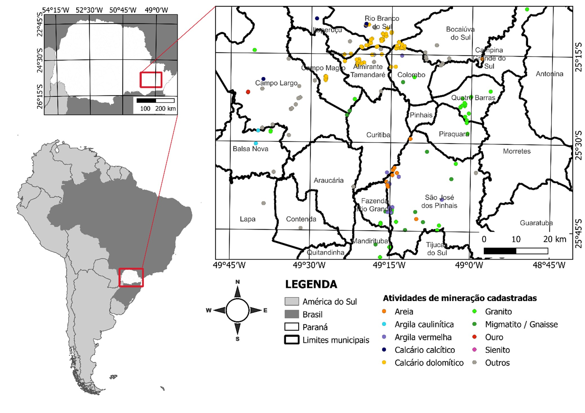

A presença de atividades de extração de calcário se destaca na Região Metropolitana de Curitiba (RMC), que abriga mais de 70 minas ativas. Na Figura 1, são identificadas as localizações das principais minas ativas e substâncias lavradas de acordo com base de dados do Plano Diretor de Mineração (2004) disponibilizado pelo Instituto Água e Terra [(IAT, 2023)](https://www.iat.pr.gov.br/Pagina/Plano-Diretor-de-Mineracao-para-Regiao-Metropolitana-de-Curitiba-2004). Sendo assim, neste estudo, locais estratégicos para instalação dos pontos de monitoramento serão selecionados conforme acessibilidade e potencial exposição aos poluentes do ar monitorados associados à mineração de calcário entre os municípios de Campo Largo, Colombo, Rio Branco do Sul e Almirante Tamandaré.

**Figura 1:** Localização das principais minas ativas, classificadas pelas substâncias lavradas, na Região Metropolitana de Curitiba.

